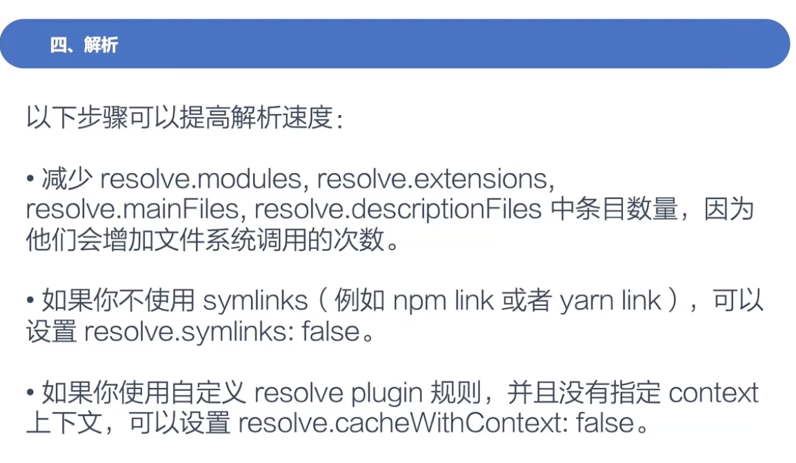
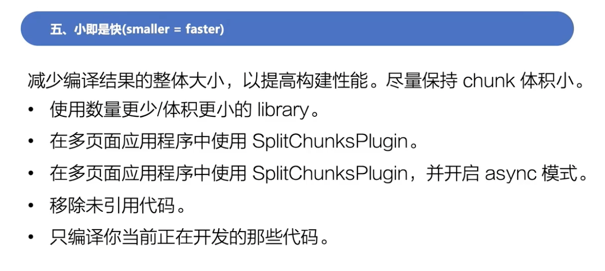
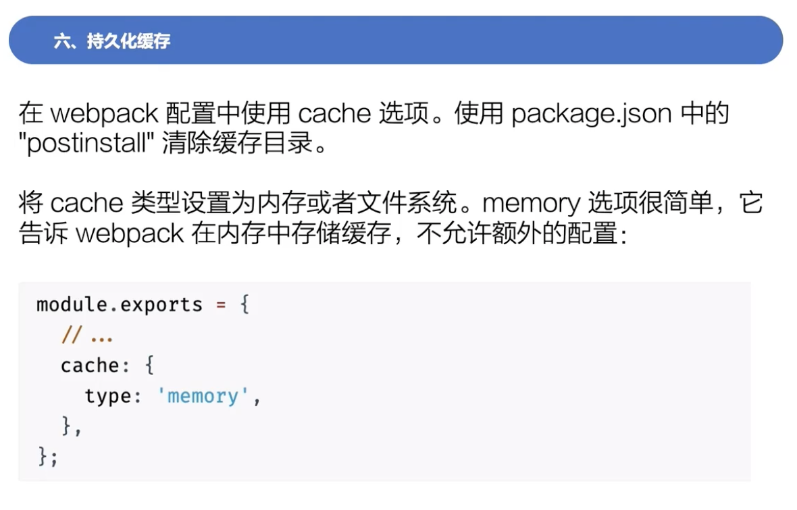
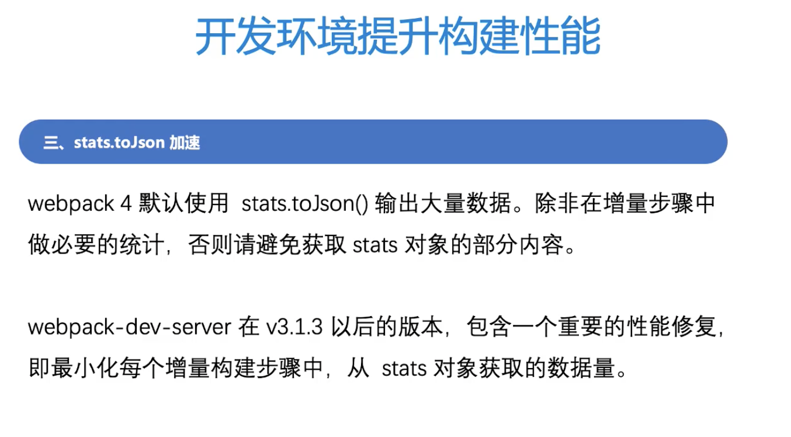
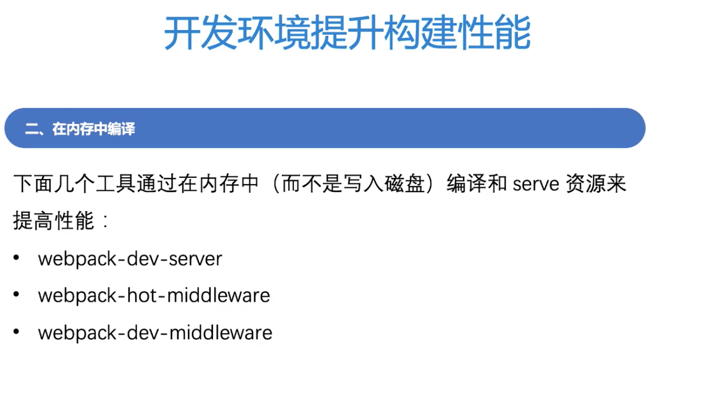
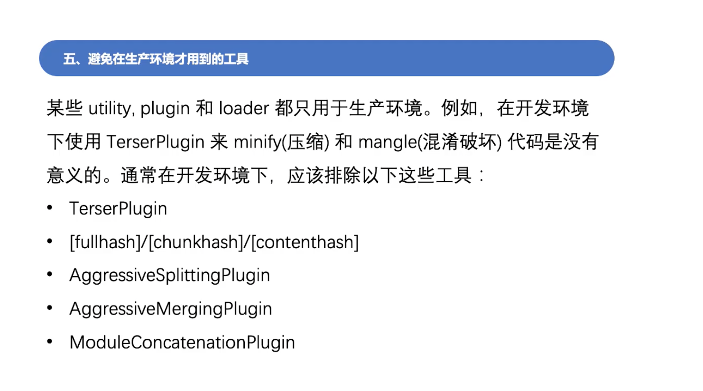

# 提升构建性能

webpack 性能提升优化分为两类
1. 利用webpack 提升网站性能，例如网站首屏时间，受益者用户
2. 开发性能: 提升打包速度，降低打包时间，受益者开发者

三个环境提升构建性能

1. 通用环境
2. 开发环境
3. 生产环境

## 通用环境优化

1. 更新到最新版本(webpack, Node.js, npm, yarn等)
2. 将loader 应用于最少数量的必要模块，比如exclude掉不必要的文件
3. 引导: 每个额外的loader/plugin 都有其启动时间，尽量少的使用工具
4. 解析: 
5. 小即是快(smaller = faster): 
6. 持久化缓存: 
7. 自定义plugin/loader: 
8. progress plugin:  
9. Dll: 

## 开发环境提升构建性能

1. 增量编译

2. 在内存中编译

3. stats.toJson 加速

4. Devtools

5. 避免在生产环境才用到的工具

6. 最小化entry chunk

7. 避免额外的优化步骤

8. 输出结果不携带路径信息

9. Node.js 版本 8.9.10-9.11.1

10. TypeScript Loader

## 生产环境提升构建性能

不启用source-map
